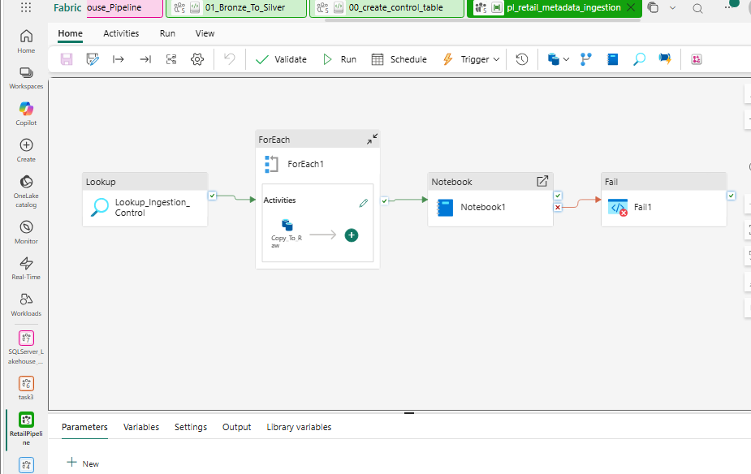

# metadata-driven-retail-data-platform/

## Overview

A production-style retail data platform built using Microsoft Fabric,
PySpark, Data Pipeline, and Power BI.

The project processes retail CSV files through metadata-driven ingestion,
transformation, data quality validation, and Bronze-Silver-Gold data layers.
## Business Use Case

The pipeline is designed to process retail inventory and sales data from multiple CSV sources using a metadata-driven approach.

The solution enables:
- Centralized configuration of source files through a control table
- Automated ingestion using Fabric Data Pipelines
- Reliable Bronze-to-Silver data transformation using PySpark
- Handling of schema changes, duplicates, and late-arriving data
- Creation of business-ready Gold-layer data for Power BI reporting
## Architecture

CSV Files
↓
Metadata Control Table
↓
Lookup
↓
ForEach
↓
Dynamic Copy Activity
↓
Bronze / Raw
↓
PySpark Transformations
↓
Silver
↓
Gold
↓
Power BI
### Pipeline

## Data Flow

1. **Source:** Retail CSV files are received from source locations.
2. **Metadata Configuration:** Source information is maintained in a control table.
3. **Lookup:** The pipeline reads the configured metadata.
4. **ForEach:** Each configured source is processed dynamically.
5. **Bronze Layer:** Raw data is ingested into the Fabric Lakehouse.
6. **Silver Layer:** PySpark performs schema handling, deduplication, joins, partitioning, and data quality validation.
7. **Gold Layer:** Business-ready data is prepared for analytics.
8. **Power BI:** Gold-layer data is used for reporting and visualization.

## Technologies

- Microsoft Fabric
- Fabric Data Pipeline
- Fabric Lakehouse
- PySpark
- SQL
- Power BI

## Key Technical Highlights

- Metadata-driven ingestion using control tables, Lookup, and ForEach activities
- Dynamic pipeline execution for multiple source files
- Bronze-Silver-Gold data architecture
- PySpark-based data transformation in Microsoft Fabric
- Schema evolution and handling of changing source structures
- Deduplication and late-arriving data handling
- Broadcast joins for optimized transformations
- Partitioning for improved data processing
- Rolling average calculations for sales analysis
- Data quality validation before downstream reporting
- Gold-layer tables designed for Power BI analytics
  
## Skills Demonstrated

- Microsoft Fabric Data Engineering
- Fabric Data Pipelines
- Fabric Lakehouse
- PySpark
- SQL
- Metadata-driven ETL/ELT
- Incremental and dynamic data ingestion
- Data transformation and cleansing
- Data quality validation
- Delta Lake concepts
- Data modeling
- Power BI reporting
### Metadata-Driven Ingestion

A metadata/control table is used to manage ingestion of multiple source
files. The pipeline uses Lookup and ForEach activities to dynamically
process the configured sources.

### Bronze Layer

Raw source data is ingested into the Bronze/Raw layer.

### Silver Layer

PySpark transformations are applied, including:

- Schema evolution
- Deduplication
- Late-arriving data handling
- Broadcast joins
- Partitioning
- Rolling average calculations
- Data quality validation

### Gold Layer

Business-ready tables are created for reporting and analytics.

### Power BI

The Gold layer is used as the source for the final Power BI reporting.

## Notebooks

### 00_create_control_table

Creates the metadata/control table used by the ingestion pipeline.

### 01_Bronze_To_Silver

Performs PySpark-based transformations from the Bronze layer to the
Silver layer.

## Project Structure

metadata-driven-retail-data-platform/
│
├── README.md
│
├── notebooks/
│   ├── 00_create_control_table.ipynb
│   └── 01_Bronze_To_Silver.ipynb
│
└── screenshots/
    └── fabric_pipeline.png
